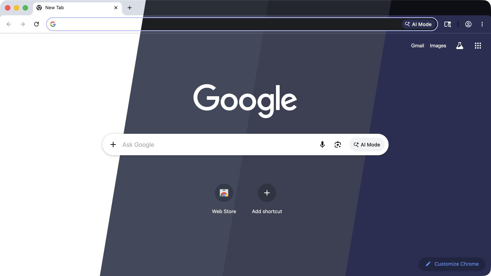

# rkpreview

Composite (or capture-and-composite) four same-size screenshots into a single
image divided by diagonal `/` cuts — used to make hero/display images for
ricekit configs that show off four themes in one shot.



*Example: Chrome rendered under the standard 4-theme lineup (Catppuccin Latte → Nord → Dracula → Hackerman), captured and composited end-to-end with `rkpreview capture --app "Google Chrome" --window-title "..." -o display.png`.*

Two modes:

- **compose** — you supply 4 pre-made screenshots; rkpreview just blends them.
  Cross-platform.
- **capture** — rkpreview drives `ricekit apply` + macOS `screencapture` to
  take all four screenshots itself, then composites. **macOS only.**

A discovery helper `windows` lists visible windows so you can pick the right
one for `capture`.

## compose mode

```bash
rkpreview compose <img1> <img2> <img3> <img4> -o <out>
```

All four inputs must share identical pixel dimensions (the use case is "the
same screenshot rendered in four different themes"). The output matches those
dimensions and shows each input as a left-to-right diagonal slice.

```
┌─────────┬────────┬────────┬─────────┐
│ img1   /│ img2  /│ img3  /│ img4    │
│       / │      / │      / │         │
│      /  │     /  │     /  │         │
└─────────┴────────┴────────┴─────────┘
```

The slant is fixed at `H / 6` (about a 9° tilt for 16:9 inputs). There is
deliberately no flag to tune it — every ricekit display image should share the
same cut geometry so they read as a set.

## capture mode

```bash
rkpreview capture --app "Slack" -o display.png
```

For each of the 4 standard themes, in order, rkpreview:

1. Applies the theme via `ricekit apply <slug>`.
2. Waits the configured **settle delay** (default 2000ms; some Electron apps
   override to 3500ms — see `rkpreview.toml`).
3. Activates the target app and forces its frontmost window to the configured
   size + position via `osascript`.
4. Waits the **post-focus delay** (default 300ms) for the window-server to
   redraw.
5. Resolves the window's `CGWindowID` via the macOS window-list API.
6. Captures that window with `screencapture -l <id>`.

After all four shots are taken, it composites them into one image at `<out>`.
The originally-active theme is **always restored on exit** — including on
Ctrl+C and on any error along the way.

### Flags

| Flag              | Default                 | Notes                                              |
| ----------------- | ----------------------- | -------------------------------------------------- |
| `--app`           | required                | App display name or bundle ID                      |
| `-o, --output`    | required                | Output path                                        |
| `--config`        | `tools/rkpreview/rkpreview.toml` | Override config file                      |
| `--window-title`  | none                    | Substring (case-insensitive) for multi-window apps |
| `--window-id`     | none                    | Numeric CGWindowID — skips all matching            |
| `--width`         | from config (1280)      | Window width                                       |
| `--height`        | from config (720)       | Window height                                      |
| `--position`      | from config (100,100)   | Top-left as `x,y`                                  |
| `--settle-ms`     | from config (2000)      | Delay after `ricekit apply`                        |
| `--post-focus-ms` | from config (300)       | Delay after focus + resize                         |
| `--auto-install`  | off                     | Install missing themes from marketplace            |

### Picking a window when the app has multiple

The default behavior is "frontmost window of the named app". If you have e.g.
Chrome open with multiple profile windows, focus the target window before
running, or use `--window-title` to match by title substring:

```bash
rkpreview capture --app "Google Chrome" --window-title "Screenshot Profile" -o out.png
```

Chrome's window title is the active tab's page title by default; to make
profile-name matching work, enable "Show profile name in title" in Chrome
settings. Most other apps (Slack workspaces, Linear teams, Obsidian vaults)
already put a disambiguator in the title naturally.

If a title substring matches more than one window, rkpreview errors out with
the candidate list rather than guessing.

### Theme install check

Before any capture happens, rkpreview verifies all 4 standard themes are
installed under `~/.config/ricekit/themes/`. If any are missing it errors with
the exact `ricekit marketplace install` commands you'd need to run, or — with
`--auto-install` — it shells out to install them itself.

### Required macOS permissions

The first time you run `capture`, macOS will prompt for two permissions for
whatever process is invoking rkpreview (your terminal, or the binary directly
if you ran it standalone):

- **Screen Recording** — for `screencapture` to read window pixels.
- **Accessibility** — for `osascript` to position and activate other apps'
  windows.

Grant both in System Settings → Privacy & Security. rkpreview detects the
common failure modes (empty PNG, osascript "not authorized" error) and emits
targeted error messages pointing at the right setting.

## windows helper

```bash
rkpreview windows --app "Google Chrome"
```

Lists every visible window owned by that app, with CGWindowID, bounds, and
title. Omit `--app` to list every visible window. Useful for finding the
right `--window-id` value when title matching isn't enough.

**Window titles require Screen Recording permission.** macOS only populates
the `kCGWindowName` field of its window list for processes that have Screen
Recording access — without it, every title comes back blank even when the
window has a name set (including Chrome's "Name window…" feature). If
`rkpreview windows` shows empty titles, grant Screen Recording to your
terminal in System Settings → Privacy & Security → Screen & System Audio
Recording, then **quit and relaunch the terminal** (macOS doesn't refresh
permissions for already-running processes). The same requirement applies to
`capture --window-title`.

## Standard theme order

The ricekit convention for any 4-up display image is defined in
`tools/rkpreview/rkpreview.toml`. Maintainers can edit it there; users can
override it locally at `~/.config/ricekit/rkpreview.toml`.

Current standard:

| Slice | Theme            | Variant | Background |
| ----- | ---------------- | ------- | ---------- |
| 1     | Catppuccin Latte | light   | `#eff1f5`  |
| 2     | Nord             | dark    | `#2e3440`  |
| 3     | Dracula          | dark    | `#282a36`  |
| 4     | Hackerman        | dark    | `#0b0c16`  |

The lineup was chosen for perceptual smoothness in
[OKLab](https://bottosson.github.io/posts/oklab/) — a color space where
Euclidean distance approximates how different two colors actually look to a
viewer.

Why this order:

- **Strictly monotone perceptual lightness.** OKLab L ≈ 0.96 → 0.32 → 0.29 →
  0.16. Each step is unambiguously darker than the last — no plateaus, no
  zigzags. The eye reads it as a single smooth fade.
- **Tight cool-blue hue family.** All four backgrounds sit between 264° and
  279° on the OKLCH hue wheel. Total hue swing across the three cuts is just
  **15.4°** — the gradient stays unmistakably blue from end to end, so no
  individual slice looks like the odd one out.
- **One light anchor, three darks.** The unavoidable light→dark jump happens
  once at the first cut and dominates the image's contrast; the three darks
  then descend smoothly to give a "day-into-night" arc.
- **Four distinct theme families.** Catppuccin, Nord, Dracula, and Omarchy's
  Hackerman are four separately-maintained projects — the image reads as
  "ricekit supports lots of themes" rather than "here are four shades of one
  family".

Use this order for any new config's display image unless you have a specific
reason to deviate (e.g. a config that only ships two of the four themes).

## Config file resolution

`rkpreview capture` loads its config in this order, stopping at the first hit:

1. `--config <path>` if provided on the command line.
2. `~/.config/ricekit/rkpreview.toml` if it exists.
3. The compiled-in default — `tools/rkpreview/rkpreview.toml`, baked into the
   binary at build time.

Schema (see `tools/rkpreview/rkpreview.toml` for the canonical example):

```toml
themes = ["rose-pine-dawn", "everforest", "nord", "catppuccin-mocha"]

[capture]
window_width = 1280
window_height = 720
window_position = [100, 100]
settle_ms = 2000
post_focus_ms = 300

[capture.apps."Slack"]    # per-app override, keyed by --app value
settle_ms = 3500
```

## Install

```bash
cd tools/rkpreview
cargo install --path .
# binary at ~/.cargo/bin/rkpreview (assumes that's on your PATH)
```

## Producing a config display image

Manually (cross-platform):

1. Capture the same screenshot of the config under each of the four standard
   themes. Use identical window geometry and identical viewport content.
2. `rkpreview compose <theme1.png> <theme2.png> <theme3.png> <theme4.png> -o display.png`
3. Drop `display.png` next to the config.

Automated (macOS):

```bash
rkpreview capture --app "Linear" -o display.png
```

If the source screenshots end up different sizes (whether you took them
manually or the capture pipeline somehow produced mismatched ones), rkpreview
refuses to run rather than silently distort. Re-capture so all four match.
